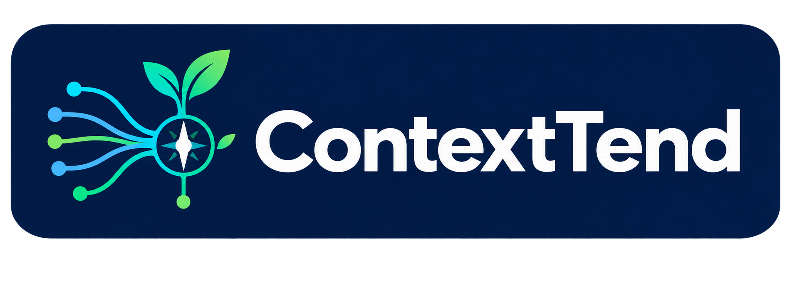

<p align="center">
  
</p>

# ContextTend

> Управление живыми знаниями проекта для программных агентов.

[English version](README.md)

ContextTend объясняет Codex и другим программным агентам, где находится
долговечная истина о проекте, насколько авторитетен каждый источник, кто может
его изменять и не устарела ли локальная инфраструктура. Прежде чем что-либо
создавать, ContextTend принимает уже существующую документацию и процессы.

## Возможности MVP

- детерминированное сканирование репозитория и формирование Knowledge Registry;
- безопасный цикл dry-run/apply с защитой от конфликтов при параллельных изменениях;
- адаптеры для нативной и общей структуры, GitHub Spec Kit, OpenSpec, Agent OS и GSD;
- полноценные SPEC/requirements с человеческим владением и тематической навигацией;
- проверка схем, путей, владельцев, авторитетности, ссылок, ресурсов и адаптеров;
- сравнение хешей источников и явная фиксация состояния синхронизации и аудита;
- шесть полноценных репозиторных Codex Skills для онбординга, начального
  заполнения, непрерывности активной работы, синхронизации, аудита памяти и
  аудита harness;
- устойчивые к прерыванию checkpoints активной работы с детерминированным
  восстановлением по Git и файловой системе и необязательными Codex hooks с
  малым расходом контекста;
- полностью локальная работа без телеметрии, вызовов моделей, базы данных или daemon.

## Установка

- Node.js 20 или новее
- pnpm 11

Запуск напрямую из npm без добавления зависимости в целевой репозиторий:

```powershell
pnpm dlx contexttend --help
pnpm dlx contexttend init C:\path\to\repository --dry-run
```

Либо установите ContextTend в проект, чтобы использовать короткую команду
`pnpm contexttend`:

```powershell
pnpm add --save-dev contexttend
pnpm contexttend --help
```

Для разработки из этого репозитория:

```powershell
pnpm install
pnpm build
pnpm contexttend --help
```

До первого выпуска в npm доступен только вариант для разработки. Полная
процедура выпуска для владельца описана в
[`docs/releasing-npm.md`](docs/releasing-npm.md).

Команды для человека начинаются с ASCII-логотипа ContextTend. Интерфейсы для
автоматизации остаются чистыми: `--json`, `--quiet` и `--version` никогда не
выводят баннер.

## Первый запуск

Для существующего репозитория рекомендуется сначала выполнить предварительный
просмотр:

```powershell
pnpm contexttend init C:\path\to\repository --dry-run
```

Проверьте все обнаруженные системы знаний, соответствия источников, владельцев
и предлагаемые файлы. Затем выполните:

```powershell
pnpm contexttend init C:\path\to\repository --apply
pnpm contexttend validate C:\path\to\repository
pnpm contexttend status C:\path\to\repository
```

Флаг `--native` фиксирует предпочтение нативной структуры ContextTend, но всё
равно не создаёт второй канонический источник, если соответствующей ролью уже
владеет существующий фреймворк или документ.

Теперь откройте этот репозиторий в Codex и поставьте обычную задачу по проекту.
Управляемый блок в `AGENTS.md` предписывает Codex автоматически использовать
`$context-onboard`, пока `lastOnboarding` отсутствует или равен null. Онбординг
можно запустить и явно:

```text
$context-onboard
```

Skill начинает с полного существующего `AGENTS.md`, инвентаризирует другие
зарегистрированные и стандартные источники знаний и при необходимости
использует специализированные Skills для harness, памяти и начального
заполнения. Перед изменениями он показывает `ONBOARDING PLAN`. Сокращение или
удаление ранее созданного пользователем содержимого требует подтверждения,
если текущий запрос уже явно не разрешает такую миграцию. Для больших файлов
сначала записываются и проверяются целевые документы, и лишь затем сокращается
`AGENTS.md`. Команда `init --apply` сохраняет безопасный лексический baseline,
а онбординг нельзя отметить завершённым, пока параметры конфигурации, пути,
флаги или символы кода из этого baseline отсутствуют в активной документации
или самодостаточном candidate-документе. Одной ссылки на историю Git
недостаточно для сохранения информации. Успешный запуск фиксирует онбординг и
возвращается к исходной задаче.

## Требования: от одного SPEC к тематическим документам

Новый нативный проект получает `SPEC.md` с владельцем `human`, если источника
требований ещё нет. Здесь описывают конкретные требования, ограничения и
ожидаемые результаты приёмки. Неизвестные требования остаются явными unknowns.

| Документ | Назначение |
| --- | --- |
| GOALS | Зачем существует проект и каких результатов он добивается |
| PRODUCT | Пользователи, поведение продукта и продуктовый intent |
| SPEC | Конкретные требования, ограничения и ожидания приёмки |
| ARCHITECTURE | Архитектурное устройство системы |
| PLANS | Что реализуется сейчас и в каком порядке |

Для небольшого нативного проекта:

```text
AGENTS.md                 # компактная карта инструкций и источников
SPEC.md                   # требования непосредственно в файле, owner: human
ARCHITECTURE.md            # существующая архитектура, если есть
docs/
  GOALS.md
  PRODUCT.md
  PLANS.md
  decisions/
  context/
.contexttend/             # registry, состояние, управляемые руководства
.agents/skills/           # установленные семантические процессы
```

Когда отдельные темы требуют независимого чтения, корень остаётся стабильным:

```text
SPEC.md                   # назначение, общие ограничения, указатель authoritative detail
docs/spec/
  identity.md             # пример темы; имена выбираются под проект
  interfaces.md
  delivery.md
```

В registry это один логический канонический источник:

```yaml
requirements:
  path:
    - SPEC.md
    - docs/spec/
  role: requirements
  authority: canonical
  owner: human
  adapter: native
```

Агент читает общие ограничения SPEC и проходит только по релевантным ссылкам.
Корень не дублирует дочерние требования. Каждый активный тематический документ
должен быть доступен из SPEC напрямую или через связанный тематический индекс.

Разделение выполняет `context-bootstrap`; `context-sync` может направить к
нему при необходимости. Процесс сохраняет текст требований, ID, исключения
и происхождение, проверяет все назначения до сокращения оригинала, повторно
сверяет хеши исходника и registry, сохраняет ID и владельца источника.
Перенесённые относительные ссылки должны вести к прежним целям. Превышение
размера не разрешает автоматическое разделение или вывод требований из кода.
Подробности: [жизненный цикл и протокол переноса без потерь](.contexttend/guides/requirements.md).

### Принятие существующих источников и обновления

- Существующий `SPEC.md` принимается без перезаписи; вместе с `docs/spec/`
  он составляет один источник. Также обнаруживаются `SPECIFICATION.md`,
  `REQUIREMENTS.md`, `docs/REQUIREMENTS.md` и каталоги `requirements/`,
  `docs/requirements/`, `specs/`, `docs/spec/`.
- При первоначальном discovery независимые соглашения о требованиях дают
  явный конфликт канонической роли. При повторном init приоритет сохраняют
  существующие записи registry; новые источники проверяют до изменения mapping.
- Spec Kit, OpenSpec, Agent OS и GSD сохраняют внешнее владение.
  Обычные документы для занятых ими канонических ролей становятся supporting.
  Даже начальная установка framework без готовых specs предотвращает
  создание конкурирующего нативного SPEC.
- `createMissingNativeSources: false` в `.contexttend/config.yaml` отключает
  создание недостающих нативных документов, сохраняя adoption.
- `update --apply` обновляет только управляемую инфраструктуру. Старые проекты
  без SPEC остаются валидными: registry и человеческие документы не меняются.
  Для явного добавления или adoption требований сначала проверьте
  `contexttend init . --dry-run`, затем примените `contexttend init . --apply`
  и используйте bootstrap для смыслового наполнения.
  State schema v2 и registry v1 сохраняются.

### Кто что редактирует

Обычно человек редактирует цели, продуктовый intent и требования с владельцем
human либо передаёт агенту подтверждённое изменение. Агент поддерживает
совместные архитектуру, планы и решения на основе подтверждённых изменений,
а implementation context — по проверяемым данным. Сам по себе код никогда
не меняет человеческие требования.

ContextTend через preview/apply поддерживает generated metadata, установленные
Skills, руководства и свой блок AGENTS. `state.json`, managed hashes и recovery
изменяет CLI; вручную их не редактируют. Registry/config меняют как осознанную
настройку, а не вследствие автоматического переноса фактов из кода.
Внешние артефакты изменяют через процессы их framework.

Validation проверяет канонические конфликты, корректность и существование
путей, соответствие SPEC и дерева registry, поддерживаемые локальные ссылки
и достижимость тем. Документ требований или выбранная цепочка инструкций
репозитория больше 16 KiB даёт только рекомендацию пересмотреть объём чтения.
Это не лимит Codex: глобальные инструкции, fallback filenames и настройки
агента проверяются harness audit отдельно. Поддерживаются inline/reference
ссылки вне примеров кода; heading anchors и произвольные Markdown extensions
требуют отдельного review.

`context-sync` различает новые/изменённые подтверждённые требования, изменения
реализации и drift. `memory-audit` проверяет устаревшие и повторяющиеся
требования, невыполненные обязательства, неподтверждённые выводы из кода и
пробелы навигации. Детерминированная проверка не доказывает правильность смысла.

Эти же файлы работают со старыми Codex и другими агентами с доступом к
репозиторию: если вызов Skills недоступен, достаточно прочитать `SKILL.md`.
Конкретная модель, hooks, subagents, скрытое состояние или большой контекст
не требуются. [Governance](.contexttend/guides/agent-governance.md) разделяет
intent пользователя, область инструкций, требования и факты реализации;
`harness-audit` указывает точные правила, вызывающие конфликт или лишнюю паузу.

## Активная работа с восстановлением после прерывания

Для обычной небольшой задачи продолжайте работать как обычно. Для существенной
многоэтапной задачи управляемая инструкция в `AGENTS.md` позволяет Codex
автоматически выбрать `$context-work`. Его также можно вызвать явно:

```text
$context-work start
$context-work checkpoint
$context-work resume
$context-work complete
```

Skill создаёт одну активную работу, заполняет `.contexttend/work/current.md`
компактным семантическим снимком и вызывает детерминированный CLI для фиксации
хешей. Checkpoints обновляются после существенных фаз, решений, проверок или
блокеров, а не после каждой команды. Размер `current.md` ограничен 8 КиБ;
файл заменяется на месте и не превращается в растущий журнал.

После прерывания откройте тот же репозиторий в новой сессии программного агента
и напишите:

```text
Продолжай.
```

Если агент следует `AGENTS.md`, он обнаружит непустой `activeWork`, загрузит
`$context-work resume`, прочитает checkpoint, выполнит `work status`, проверит
Git status/diffs и подходящие тесты, а затем продолжит с первого незавершённого
проверенного шага. Более конкретная подсказка, например «работа прервалась после
миграции; проверь Git и продолжай», уточняет актуальное намерение и улучшает
восстановление, но состояние репозитория и тесты всё равно проверяются.

Детерминированным CLI можно управлять вручную из checkout ContextTend:

```powershell
pnpm contexttend -- work start C:\path\to\repository --title "Add billing" --objective "Implement and verify invoice creation"
pnpm contexttend -- work status C:\path\to\repository
# Редактируйте .contexttend/work/current.md по мере выполнения работы
pnpm contexttend -- work checkpoint C:\path\to\repository
pnpm contexttend -- work checkpoint C:\path\to\repository --state blocked
pnpm contexttend -- work complete C:\path\to\repository
```

`work complete` отклоняет устаревший checkpoint. Семантический снимок сначала
должен соответствовать фактическому fingerprint репозитория и обязательной
структуре документа. Обычный вывод status показывает не более 25 изменённых
путей, а JSON не содержит хешей, чтобы экономить контекст агента; добавляйте
`--verbose` только для намеренной машинной диагностики.

### Необязательные Codex hooks

Переносимый процесс работает и без hooks. Чтобы улучшить восстановление при
внезапном прерывании Codex, сначала просмотрите, а затем явно установите hooks
репозитория:

```powershell
pnpm contexttend -- work install-codex-hooks C:\path\to\repository --dry-run
pnpm contexttend -- work install-codex-hooks C:\path\to\repository --apply
```

После этого используйте `/hooks` в Codex, чтобы проверить установленные
определения и сделать их доверенными. ContextTend добавляет свои handlers в
существующий `.codex/hooks.json`, не заменяя другие hooks. `SessionStart`
передаёт только короткий указатель на активную работу (не более 200 токенов);
`PostToolUse`, `Interrupt` и `SessionEnd` обновляют `recovery.json` без вывода в
контекст модели. `Stop` запрашивает не более одного дополнительного прохода
checkpoint и учитывает `stop_hook_active`, предотвращая циклы. Для проектных
hooks необходим Git-репозиторий, чтобы их команда могла надёжно определить его
корень. Жизненный цикл, доверие и конфигурация описаны в
[официальной документации Codex hooks](https://learn.chatgpt.com/docs/hooks).

Ни один hook не читает `transcript_path`. Файл восстановления содержит Git
HEAD, изменённые пути, хеши и fingerprint, но не prompts, содержимое файлов,
рассуждения или расшифровки сессий.

### Claude и другие программные агенты

Claude может использовать тот же checkpoint без hooks:

```powershell
pnpm contexttend -- work install-claude-bridge C:\path\to\repository --dry-run
pnpm contexttend -- work install-claude-bridge C:\path\to\repository --apply
```

Команда сохраняет существующее содержимое `CLAUDE.md` и добавляет один
ограниченный маркерами bridge к `AGENTS.md` и
`.agents/skills/context-work/SKILL.md`. Для другого агента, который не читает
`AGENTS.md`, добавьте эквивалентную короткую инструкцию в его нативный файл
правил. Обычный веб-чат без доступа к репозиторию, файловой системе, Git и
командам не может выполнить автоматическое восстановление.

## CLI

| Команда | Назначение |
| --- | --- |
| `init` | Сканирование, обнаружение, принятие источников, предложение и необязательное применение изменений с последующей проверкой |
| `status` | Сводка версии, источников, адаптеров, аудитов и состояния проекта |
| `doctor` | Объяснение детерминированных находок и способов исправления |
| `validate` | Проверка для CI; при ошибках возвращает код выхода 1 |
| `diff` | Сравнение хешей зарегистрированных источников с сохранённым baseline |
| `adapters` | Вывод фактов о проекте и оснований обнаружения адаптеров |
| `agents-coverage` | Создание/проверка снимка лексической сохранности при миграции AGENTS |
| `update` | Предварительный просмотр или применение только безопасных обновлений управляемых ресурсов |
| `migrate` | Предварительный просмотр или применение миграций схемы машинного состояния |
| `record` | Фиксация завершённого семантического процесса (обычно вызывается Skills) |
| `work start/status/checkpoint/recover/complete` | Управление одним переносимым ограниченным checkpoint активной работы |
| `work install-codex-hooks` | Предварительный просмотр или установка необязательных Codex lifecycle hooks |
| `work install-claude-bridge` | Предварительный просмотр или установка ограниченного маркерами Claude bridge без hooks |

Все команды поддерживают `--json` там, где полезна структурированная
автоматизация. `init`, `update` и `migrate` ничего не записывают без `--apply`.

## Процессы Codex

После инициализации актуальный Codex обнаруживает следующие Skills в
`.agents/skills/`:

- `$context-onboard` завершает первичную семантическую инициализацию. Он
  анализирует и классифицирует существующий `AGENTS.md` вплоть до независимо
  применимых правил, проверяет пересекающиеся знания, координирует
  специализированные Skills, предлагает миграцию без потерь, заполняет
  недостающие канонические и подсистемные источники, проверяет покрытие,
  фиксирует завершение и возвращается к исходному запросу.
- `$context-bootstrap` заполняет отсутствующие или шаблонные нативные знания,
  не придумывая неизвестный продуктовый замысел.
- `$context-work` начинает, фиксирует, возобновляет, блокирует или завершает
  одну существенную работу. Он сверяет семантический прогресс с фактическими
  данными Git, файловой системы и тестов, а не доверяет устаревшей памяти.
- `$context-sync` выполняет матрицу влияния на документацию после значимых
  изменений кода. «Обновление долговечных знаний не требуется» — допустимый
  результат.
- `$memory-audit` создаёт доступный только для чтения отчёт на основе
  доказательств об устаревших, противоречивых, дублирующихся, потерянных,
  неподтверждённых, заменённых, отсутствующих, неверно назначенных или
  перегруженных знаниях.
- `$harness-audit` проводит свежее исследование официальных материалов
  OpenAI/Codex и предлагает проверенные изменения harness, не мигрируя проект.

Короткий управляемый блок в `AGENTS.md` направляет агентов к registry и не
служит свалкой знаний. Codex Skills поддерживают явный вызов и неявный выбор по
описанию; управляемый блок задаёт детерминированное условие онбординга, не
полагаясь лишь на распознавание prompt.

## После онбординга: повседневная работа

Большая часть работы должна оставаться обычной работой в Codex. ContextTend —
слой обслуживания знаний, а не отдельная методология разработки:

```text
init один раз -> context-onboard один раз -> обычная разработка
             -> context-work только для существенных задач, чувствительных к прерыванию
             -> context-sync после значимых изменений
             -> memory-audit периодически
             -> harness-audit при изменении Codex harness
```

### Проверка результата онбординга

Когда `$context-onboard` завершится, до публикации пакета выполните из checkout
ContextTend следующие команды:

```powershell
pnpm contexttend status C:\path\to\repository
pnpm contexttend validate C:\path\to\repository
pnpm contexttend diff C:\path\to\repository
```

У здорового репозитория записано время онбординга, validation проходит, а сразу
после процесса отсутствуют изменённые зарегистрированные источники.

### Исправление ранее незавершённого онбординга

Если старая версия ContextTend уже сократила `AGENTS.md`, сначала обновите
управляемые ресурсы и получите настоящую версию до миграции, а не сокращённую
рабочую копию. Из checkout ContextTend выполните:

```powershell
pnpm contexttend update C:\path\to\repository --apply
pnpm contexttend agents-coverage snapshot C:\path\to\repository --source AGENTS.md --git-ref <pre-migration-ref>
pnpm contexttend agents-coverage snapshot C:\path\to\repository --source AGENTS.md --git-ref <pre-migration-ref> --apply
```

Затем откройте целевой репозиторий в Codex и явно вызовите `$context-onboard`,
попросив исправить предыдущую миграцию из исходного Git ref, записанного в
`.contexttend/agents-coverage.json`. Skill должен прочитать исходный файл,
восстановить подробные знания в подсистемных документах или самодостаточных
candidate-документах, успешно выполнить `agents-coverage check` и только после
этого снова зафиксировать онбординг. Если исходный файл никогда не был
закоммичен, сохраните его как временный неотслеживаемый файл
`.contexttend/original-agents-source.md` и передайте этот путь через `--source`,
не указывая `--git-ref`. Не помещайте исходную копию в `docs/` или
`.contexttend/candidates/`: это активные цели проверки покрытия, и такая копия
обесценит проверку сохранности.

### Во время обычной разработки

Управляемый блок `AGENTS.md` предписывает Codex сверяться с Knowledge Registry
и выполнять context sync после значимых изменений. Обычно достаточно просто
попросить Codex реализовать следующую задачу. Явно вызывайте `$context-sync`
после широкого или важного изменения, когда хотите сделать проверку
документации однозначной.

Когда существует одна активная работа, «продолжай» или «возобнови» относится к
ней. Перед действиями агент сверяет `current.md` с живым рабочим деревом.
Дополнительный пользовательский контекст имеет приоритет над старым checkpoint,
а код, Git, канонические знания и тесты остаются доказательствами фактически
выполненной работы.

К значимым относятся изменения поведения продукта, архитектуры, бизнес-правил,
публичного интерфейса, ограничений безопасности или надёжности, а также
долговечных решений или планов. Исправление опечаток, форматирование и
внутренний рефакторинг без изменения долговечных фактов обычно не требуют
обновления знаний. Корректный результат sync — либо подтверждённое фактами
обновление документации, либо `No durable knowledge update required`.

Запускайте Skills аудита в осознанных контрольных точках, а не после каждой
задачи:

| Процесс | Когда запускать |
| --- | --- |
| `$memory-audit` | Перед выпуском, миграцией или крупным рефакторингом; после существенной переработки документации; при признаках устаревания или противоречий источников |
| `$harness-audit` | После изменения механизмов Skills, plugins, конфигурации или discovery в Codex либо когда локальные предположения о harness могли устареть |
| `$harness-audit full` | Для первой глубокой проверки старого harness или после крупной переработки Codex/harness |

### Когда использовать детерминированный CLI

| Команда | Когда запускать |
| --- | --- |
| `status` | В любой момент для быстрой сводки здоровья и последних процессов |
| `validate` | В CI и после ручного изменения конфигурации или registry ContextTend |
| `diff` | Чтобы увидеть изменения зарегистрированных знаний после последнего успешного семантического процесса |
| `doctor` | Когда validation не проходит и нужны рекомендации по исправлению |
| `adapters` | После добавления или изменения Spec Kit, OpenSpec, Agent OS, GSD или другой обнаруживаемой системы знаний |
| `agents-coverage check` | Во время миграции AGENTS и перед фиксацией онбординга; число пропущенных anchors должно быть равно нулю |
| `init` | Один раз для каждого репозитория и повторно в preview-режиме при принятии новой внешней системы знаний |
| `update` | После обновления ContextTend для обновления только управляемых ContextTend ресурсов; перед `--apply` используйте preview |
| `migrate` | Только когда ContextTend сообщает о необходимости миграции схемы машинного состояния |
| `work status` | При возобновлении, передаче работы или проверке актуальности checkpoint |
| `work recover` | Для ручного обновления машинных данных восстановления без hooks; обычно этим управляют Skills |
| `work start/checkpoint/complete` | Обычно вызываются `$context-work`; ручное управление жизненным циклом также поддерживается |

`update` не обновляет знания проекта, а `record` нельзя запускать вручную лишь
для очистки `diff`. `record` принимает текущие хеши источников как успешный
семантический baseline, поэтому Skills онбординга, синхронизации и аудита
вызывают его только после успешных проверок и validation. Ручная фиксация
непроверенного состояния способна скрыть реальный drift документации.

Candidate-документы в `.contexttend/candidates/` — это неразрешённые
долговечные знания, а не одноразовые логи. Храните самодостаточные candidates в
Git, если политика репозитория явно не назначает другого долговечного
владельца.

### Что хранить в Git

Коммитьте `AGENTS.md`, `.agents/` и `.contexttend/`, чтобы другой аккаунт или
программный агент получил тот же протокол управления и checkpoints.
Управляемый `.contexttend/work/.gitignore` исключает `recovery.json`, потому что
это локальный машинный файл, который часто обновляется. `current.md` и state
можно коммитить, когда передача должна работать между машинами; проверяйте их в
рамках обычной политики репозитория для чувствительных данных. Необязательные
`.codex/hooks.json` и `CLAUDE.md` следует коммитить, только если команда хочет
использовать эти интеграции совместно.

## Совместимость

Каталоги `specs/` Spec Kit, актуальные specs и changes OpenSpec, product /
standards / specs Agent OS и артефакты `.planning/` GSD остаются во владении
этих систем. ContextTend регистрирует их как внешние источники и не переписывает
их и не создаёт конкурирующую систему требований и планирования.

## Проверки при разработке

```powershell
pnpm typecheck
pnpm lint
pnpm test
pnpm build
```

Исследовательская база находится в
[`docs/research/landscape-2026-09.md`](docs/research/landscape-2026-09.md), а
инженерная граница подробно описана в [`ARCHITECTURE.md`](ARCHITECTURE.md).

## Текущие ограничения

- Адаптеры на основе соглашений намеренно не разбирают manifest каждого
  конкретного выпуска фреймворка; harness audits отмечают предположения для
  проверки.
- Детерминированная validation выявляет структурные проблемы, а не
  семантическую истинность.
- AGENTS coverage — консервативный лексический предохранитель. Он выявляет
  отсутствующие идентификаторы конфигурации, символы, флаги и пути, но не может
  доказать, что переписанный текст сохранил исходный смысл; эту проверку
  обеспечивает журнал онбординга.
- Неявный выбор Skill выполняется моделью. Управляемый trigger в `AGENTS.md`
  делает первичный онбординг ожидаемым, а `$context-onboard` остаётся явным
  запасным вариантом.
- Ни одна система не может гарантировать семантически свежий финальный
  checkpoint при внезапной остановке процесса, машины или квоты. ContextTend
  гарантирует обнаружение устаревшего состояния и детерминированные данные для
  восстановления; следующий агент восстанавливает семантику по репозиторию.
- Codex hooks необязательны, требуют явной установки и проверки доверия и сейчас
  устанавливаются только для Git-репозиториев. Возобновление без hooks остаётся
  полностью рабочим.
- Автоматическое «продолжай» требует программного агента, который читает
  поддерживаемый файл инструкций репозитория и имеет доступ к файловой системе
  и Git.
- Упаковка plugin, hosted-сервисы и автоматические миграции
  фреймворков не входят в MVP.

## Выпуск в npm

[Инструкция выпуска](docs/RELEASING.md) описывает настройку npm Trusted Publisher
и публикацию через GitHub Actions. Один раз укажите в настройках пакета npm:
владелец `klev-o`, репозиторий `context-tend`, workflow `publish.yml`, разрешение
на прямой `npm publish`; поле environment оставьте пустым. Секрет `NPM_TOKEN`
не нужен.

Версия уже подготовлена: `0.3.0`. После коммита workflow и настройки npm:

```powershell
git push origin master
git tag -a v0.3.0 -m "ContextTend 0.3.0"
git push origin v0.3.0
```

Тег запускает проверку совпадения версий, проверку типов, тесты, сборку и
публикацию CLI в npm с меткой `latest`. Результат виден во вкладке Actions.
Обычный push ветки ничего не публикует. Для следующего выпуска измените версии
в трёх `package.json` и `CONTEXTTEND_VERSION` в `packages/core/src/domain.ts`,
сделайте коммит и отправьте новый тег. Версия не увеличивается автоматически;
предварительные версии отклоняются. Пользователи обновляют CLI командой
`npm install -g contexttend@latest`, а файлы проекта — обычным `contexttend update`.
